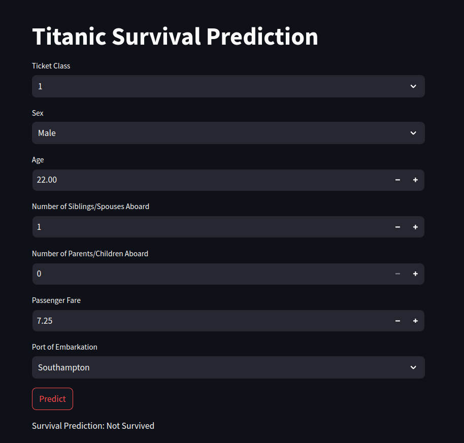

# Titanic Survival Prediction
This project aims to predict the survival of passengers on the Titanic using machine learning techniques. It involves data preprocessing, exploratory data analysis (EDA), model building, evaluation, and deployment using Streamlit.


### Project Structure
- test.ipynb: Jupyter Notebook containing data preprocessing, EDA, and model building.
- app.py: Streamlit app for making survival predictions based on user input.
- Titanic-Dataset.csv: containing the Titanic dataset.

### Tools
|  |  |  | |
| --- | --- | --- |----|
 |  |  ||  |


### Running the Project
1. Jupyter Notebook
- Open titanic.ipynb in Jupyter Notebook.
- Run the notebook to perform data preprocessing, EDA, and model building.

2. Streamlit App

- Run the Streamlit app:
```bash
streamlit run app.py
```


### Data Description
The dataset contains the following columns:

- PassengerId: Passenger ID
- Survived: Whether the passenger survived (1) or not (0)
- Pclass: Ticket class (1 = 1st, 2 = 2nd, 3 = 3rd)
- Name: Passenger's name
- Sex: Gender
- Age: Age in years
- SibSp: Number of siblings/spouses aboard the Titanic
- Parch: Number of parents/children aboard the Titanic
- Ticket: Ticket number
- Fare: Passenger fare
- Cabin: Cabin number
- Embarked: Port of embarkation (C = Cherbourg, Q = Queenstown, S = Southampton)